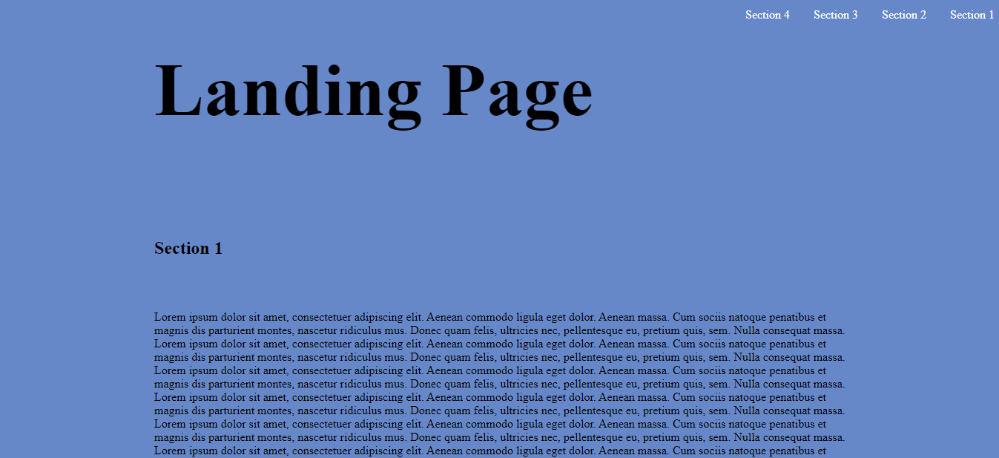

# Landing Page

# Demo-Preview

<!-- Add a demo for your project -->


# Table of contents

- [Landing Page](#landing-page)
- [Demo-Preview](#demo-preview)
- [Table of contents](#table-of-contents)
- [Installation](#installation)
- [Usage](#usage)
- [License](#license)
- [Footer](#footer)

# Installation

- ```git init```
- ```git clone https://github.com/maharezkmohammed/Landing-Page.git``` -->
- run `indext.html` file

[(Back to top)](#table-of-contents)

# Usage

- user will be able to select a section and it will be:
  -  **Highlighted** in navigation bar
  -  **Automatically transiton** to this setion in the page

[(Back to top)](#table-of-contents)

# License
[GNU General Public License version 3](https://opensource.org/licenses/GPL-3.0)

[(Back to top)](#table-of-contents)


# Footer
[(Back to top)](#table-of-contents)


<!--  -->